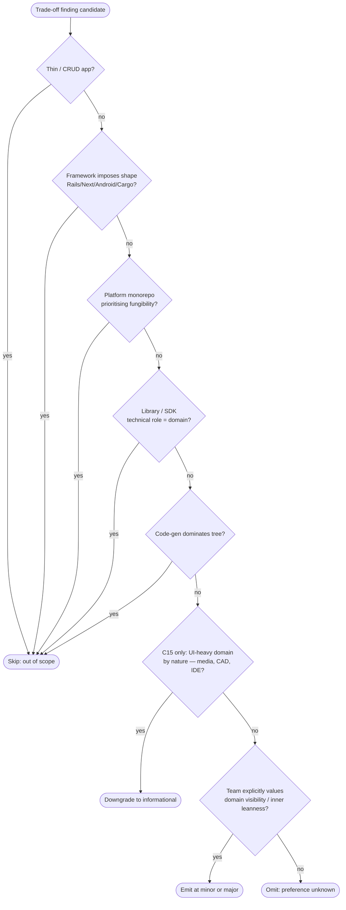

# Corollaries of the Dependency Rule

Each corollary is a discrete audit check derived from the single tenet (*dependencies point inward*). IDs are stable handles — downstream spec frameworks reference them. **Do not renumber. Do not invent new C-IDs in a finding;** unmappable observations belong in Cross-cutting Observations and trigger a skill-update request.

Findings cite the `Cn` ID and quote the smell. Skill uses **neutral vocabulary** (inner core / inner ports / outbound adapters / inbound adapters / delivery). Translate to the audited project's terms in the findings doc.

## Two tiers of softening

- **Merit gate (full flowchart, see end of file):** C15, C21, C22 only. Default outcome: skip or downgrade unless team preference is explicit.
- **Trade-off note (inline `**Trade-off:**` paragraph):** C8, C9, C12, C19, C20. Calibrates severity to language / domain / context.
- **Hard rules (no soft gate):** all other corollaries. **Absence of a trade-off note means no legitimate exception in scope** — do not invent softeners to downgrade a finding.

## Three tiers of detection

Each corollary is tagged `[D]` deterministic, `[H]` heuristic, or `[J]` judgmental — governs **how** the corollary is checked, not its severity or output. See `SKILL.md` for the full tier rubric and the deterministic-validator ladder.

- **[D] deterministic:** import-graph / AST rules. If an analyzer (ArchUnit, dependency-cruiser, Deptrac, import-linter, etc.) is installed, its output is **ground truth**. Skill consumes it; falls back to ripgrep when no analyzer is configured.
- **[H] heuristic:** threshold-driven pattern. Analyzer can express the check, but the threshold is judgment. Finding evidence must surface the threshold **and a stated rationale** for choosing it (language norm, codebase scale, prior-art citation). A threshold without rationale is the loophole.
- **[J] judgmental:** semantic / intent / context. Auditor reads source. No analyzer substitutes. **Judgmental refers to interpretation, not to evidence absence** — every tier-J finding still requires **Locations** and a quoted evidence excerpt; the prose carries the reasoning, the excerpt anchors it.

Findings record the detection method in the **Detected by** field (analyzer name, `heuristic`, or `auditor judgment`).

**Tier-D coverage caveat.** Treating an analyzer as ground truth requires its configured rules to actually cover the corollary. A dep-cruiser config with only `no-circular` says nothing about C1; verify per-corollary rule coverage before relying on analyzer silence. Uncovered tier-D corollaries fall back to ripgrep + Cross-cutting recommendation, even when an analyzer is installed and passing.

## Index

- **Direction:** [C1](#c1-dependency-inversion) · [C2](#c2-acyclic-dependencies)
- **Boundaries:** [C3](#c3-boundary-data-is-plain) · [C4](#c4-plain-domain-objects) · [C5](#c5-anti-corruption-layer) · [C6](#c6-errors-translate-at-boundaries) · [C7](#c7-use-case-return-value-leak) · [C8](#c8-boundary-types-per-use-case-not-shared)
- **Inner:** [C9](#c9-use-case--application-service-split) · [C10](#c10-healthy-feature-flow) · [C11](#c11-policy-lives-in-the-inner-core) · [C12](#c12-primitive-obsession-at-domain-layer)
- **Outer:** [C13](#c13-delivery-is-thin) · [C14](#c14-humble-object-at-boundaries) · [C15](#c15-outer-layer-fattening-merit-gated)
- **Wiring:** [C16](#c16-composition-root) · [C17](#c17-build-system-enforcement)
- **Testability:** [C18](#c18-independence-axes) · [C19](#c19-integration-tests-as-seam-checks)
- **Discipline:** [C20](#c20-over-abstraction)
- **Layout:** [C21](#c21-screaming-architecture-merit-gated) · [C22](#c22-layer--folder-merit-gated)

## Direction

### C1. Dependency Inversion *(tier: D)*

Inner defines abstractions (interfaces, traits, protocols); outer implements.

**Smell:** an outbound adapter with no inner-defined interface; an inner module importing a concrete adapter type; an interface defined next to its single implementation in the outer layer.

**Deterministic check:** package-import rule — forbid inner-package imports of outer-package types. ArchUnit `noClasses().that().resideInAPackage("inner..").should().dependOnClassesThat().resideInAPackage("adapters..")`; dep-cruiser `forbidden` rule with `from: { path: "^src/inner" }` / `to: { path: "^src/adapters" }`; Deptrac `Layer` constraints.

### C2. Acyclic Dependencies *(tier: D)*

No module transitively imports itself.

**Smell:** two outbound adapters importing each other; circular module chains. Catches what the inward-arrow check misses — the rule can be satisfied locally and still produce a cycle globally.

**Deterministic check:** graph cycle detection. ArchUnit `slices().should().beFreeOfCycles()`; dep-cruiser `no-circular`; ts-arch / Konsist cycle assertions.

## Boundaries

### C3. Boundary Data Is Plain *(tier: D)*

What crosses a layer boundary is plain data: structs, records, value objects. No ORM rows, HTTP requests, framework handles, or transport-specific types entering the inner core.

**High-leverage check.** Audit early — boundary type drift drags every other corollary down with it.

**Deterministic check:** forbid inner-core types from referencing framework packages in their public signatures. ArchUnit type-on-signature rules; dep-cruiser pattern-match on framework package names.

### C4. Plain Domain Objects *(tier: D)*

Inner entities free of framework decorators / ORM annotations / serialization hints (`@Entity`, `@JsonProperty`, `#[derive(Deserialize)]` on a domain type). Inner core should compile without the framework on the classpath.

**Deterministic check:** forbid annotation-package imports inside inner-core packages. ArchUnit `classes().that().resideInAPackage("domain..").should().notBeAnnotatedWith(...)`; dep-cruiser `forbidden` rule on annotation-package imports from inner packages.

### C5. Anti-Corruption Layer *(tier: D)*

An outbound adapter talking to a third-party with a different model **translates at the boundary**.

**Smell:** third-party model names, IDs, or shapes appearing in inner core types.

**Deterministic check:** package-import rule forbidding third-party model packages from inner core. Adapter packages may import third-party; inner core may not.

### C6. Errors Translate at Boundaries *(tier: H)*

Each layer has its own error type; transitions translate. No raw framework exceptions into inner core; no raw inner errors leaking to transport callers (JSON / FFI strings / HTTP status).

**Heuristic check:** find catch-without-rethrow-of-mapped-error patterns at layer seams; identify error types that cross multiple layers. Analyzers can flag candidate locations; auditor confirms semantics.

### C7. Use-Case Return-Value Leak *(tier: H)*

If the caller (inbound adapter / delivery) has to **distinguish success vs error outcomes** to make a decision, business logic has leaked outward. Use cases own outcome distinction; adapters translate, not branch.

**Heuristic check:** scan inbound-adapter / delivery code for `match` / `switch` / `if` chains on use-case return values. High count = likely leak; auditor reads to confirm.

### C8. Boundary Types Per Use Case, Not Shared *(tier: H)*

Sharing one DTO across multiple use cases couples them. New field for one caller forces all callers to recompile / re-test.

**Heuristic check:** count distinct use cases referencing each boundary DTO. Threshold (e.g. shared by 3+ use cases) is calibration; record threshold in finding evidence.

**Trade-off:** in CRUD and read-heavy / reporting systems, sharing a read-side DTO across multiple use cases is routine and often correct; the pragmatic camp (Mews, Miller) treats per-use-case DTOs as ceremony in those shapes. Calibrate: flag when shared DTOs span *write-side* use cases or when new field additions have caused cascading breakage in practice.

## Inner Layer

### C9. Use-Case / Application-Service Split *(tier: J)*

Inner often splits into entities (innermost, pure domain types) and use cases / application services (orchestration). Default to this split unless the inner core is small enough that the split is ceremony.

**Trade-off:** the split costs file count and indirection. For small domains, a single inner module is often clearer. Don't impose the split where ceremony beats benefit; flag at most as minor when domain size warrants but split is absent. In transaction-script systems the absence of the split is often the right answer; do not invert the burden of proof.

### C10. Healthy Feature Flow *(tier: J)*

A new feature lands inner → outbound adapter → inbound adapter → delivery → test.

**Smell:** feature requires touching outer layers first because an inner abstraction is missing.

**Judgmental:** requires reasoning about what a feature is and where it landed. Sample recent commits; trace one feature end-to-end.

### C11. Policy Lives in the Inner Core *(tier: J)*

Cache paths, retention, retry budgets, error taxonomy, rate-limit policy, naming conventions, validation rules. Adapters execute policy; they don't author it.

**Judgmental:** distinguishing policy from implementation detail requires domain understanding. Auditor reads constants / config / branches in adapter code and decides.

### C12. Primitive Obsession at Domain Layer *(tier: H)*

Domain concepts (`UserId`, `Money`, `EmailAddress`) modeled as primitive scalars (`string`, `int`, raw IDs, unwrapped UUIDs). Anemic inner-core tell.

**Heuristic check:** scan domain method signatures for repeated primitives of the same type (e.g. multiple `string` parameters in one method). Threshold calibration is per language.

**Trade-off:** value-object discipline costs newtype boilerplate in languages without first-class newtypes / opaque types / branded types. In languages with cheap newtypes (Rust, Kotlin, Scala, TS with branded types) the bar is higher; in languages where every newtype costs a class file (older Java, Go without generics), calibrate — informational severity is acceptable when language cost dominates.

## Outer Layer

### C13. Delivery Is Thin *(tier: J)*

Delivery (UI / CLI / API surface) captures input, renders state. Decisions (validation beyond shape, branching on business state, multi-step orchestration) live inward.

**Judgmental:** distinguishing business logic from presentation logic requires domain knowledge. Sample views / handlers; identify branches and decide which side of the line each is on.

### C14. Humble Object at Boundaries *(tier: J)*

Push logic *out of* untestable shells (views, DB drivers, FFI handles, framework lifecycle hooks) into testable inner objects. The boundary stays "humble" — wiring only, no decisions.

**Mechanism behind C13 and C19.** Judgmental — "what counts as logic" is the deciding question.

### C15. Outer-Layer Fattening *(tier: H, merit-gated)*

Line-count distribution skewed toward inbound adapters / delivery may suggest an anemic inner core.

**Heuristic check:** measure LOC per layer; flag when outer-layer LOC exceeds inner-layer LOC by a configured ratio. Threshold choice belongs in the finding.

**Apply the merit gate (flowchart below):** UI-heavy domains by nature (media browsers, CAD tools, IDEs, game clients, design tools) legitimately concentrate code in outer layers. Promote to minor / major only when sampling confirms business *decisions* are happening in outer code, not just rendering / capture / glue.

## Wiring

### C16. Composition Root *(tier: D)*

Concrete-to-abstract wiring happens **once**, at the outermost edge (`main`, app bootstrap, DI container config).

**Smell:** `new ConcreteAdapter()` scattered through inner modules.

**Deterministic check:** AST scan for constructor calls of adapter-package types inside inner-core packages. ArchUnit forbidden-constructor rules; dep-cruiser regex on construction sites.

### C17. Build-System Enforcement *(tier: D)*

The dependency rule is expressed via package privacy / module visibility / workspace deps / lint rules / arch-test libraries — not just discipline.

**Audit prompt:** could a junior accidentally violate the rule and have CI pass?

**Deterministic check (meta):** probe for analyzer config files (`.dependency-cruiser.js` / `.cjs` / `.json`, `deptrac.yaml`, `importlinter.cfg` / `setup.cfg` / `pyproject.toml`, `packwerk.yml`, `*ArchTest.kt` / `*ArchTest.java`, `go-arch-lint.yml`) and lint configurations enforcing layer boundaries. Absence is the violation. See the validator ladder in `SKILL.md`.

## Testability

### C18. Independence Axes *(tier: J)*

For each outer layer, ask: *could I swap this without touching the inner core?* (delivery → CLI; SQLite → Postgres; FFI → HTTP; one cloud → another). Negative answer = leak.

**Single most powerful question in an audit.** Judgmental — requires reasoning about a counterfactual swap. No analyzer decides this.

### C19. Integration Tests as Seam Checks *(tier: H)*

The inner core is tested through real outbound-adapter impls (or inner-defined test doubles), not by mocking the inner core itself.

Mock-heavy inner-core tests = signal the inner core depends on what it shouldn't.

**Heuristic check:** count mocks per test file targeting inner-core types; surface tests exceeding a calibrated threshold. Threshold belongs in finding evidence. Also flag tests of inner core that reach to DB / network without need (Fowler *Mockists Are Dead* counterpoint to over-mocking).

**Trade-off:** integration tests can be slow if outbound adapters touch I/O. Acceptable mitigations: test doubles defined alongside the inner-port interfaces (still satisfies C19 because the contract lives inward), in-memory fakes, or a fast subset for CI with a full suite nightly. *Not* acceptable: mocking inner-core types to make tests fast.

## Discipline

### C20. Over-Abstraction *(tier: H)*

DIP without purpose is ceremony. Single-impl interface with no test double, no swap rationale, no spec contract = remove.

**Heuristic check:** count single-impl interfaces with zero test doubles. ArchUnit / Konsist / dep-cruiser can express this directly. Threshold is auditor's; record in finding.

**Trade-off:** anticipated swap is sometimes legitimate (planned migration, parallel implementations in flight). Accept a written rationale recorded near the interface as a sufficient defense. Without the rationale, the interface is ceremony.

## Layout — Trade-Off Findings

### C21. Screaming Architecture *(tier: J, merit-gated)*

Top-level tree of inner layers reveals **what the system does** (`reservations/`, `billing/`) not **what it's built with** (`controllers/`, `services/`, `repositories/`).

**Apply the merit gate (flowchart below).** Layout findings emit at **informational** severity by default; promote only when team explicitly values domain visibility. **If team preference cannot be ascertained, omit the finding entirely** — do not pile up informational noise.

### C22. Layer ≠ Folder *(tier: J, merit-gated)*

Layers are dependency-direction concepts, not necessarily directory structure. Common Closure Principle often argues feature-folders over layer-folders.

Don't flag a feature-organized repo as "missing layers." Apply merit gate.

## Merit-gate flowchart (C15, C21, C22 only)

**Note on q6:** UI-heavy domains cap at `informational` regardless of stated team preference — outer-fattening is a soft signal in this domain class, and the q7 path is bypassed by design. If the team in a UI-heavy domain explicitly values inner leanness, that's still surfaced informationally; it doesn't promote.

Always record the gate outcome on the finding (`skipped`, `downgraded`, `promoted`, or `omitted`). Even omitted findings are recorded in Cross-cutting Observations as "considered but [outcome] under merit gate" so the audit is reproducible.
