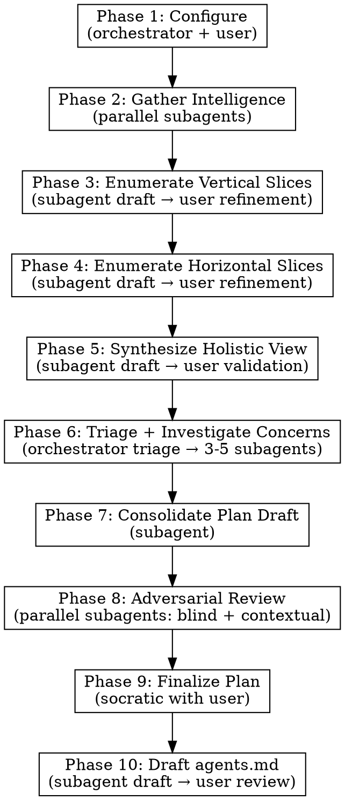

# Desloppify

## Overview

Systematic codebase audit: map the terrain (vertical slices, horizontal slices, holistic view), flag observations that warrant investigation, then dispatch focused concern-based analysis to produce a prioritized cleanup plan.

**Core principle:** Understand first, diagnose second. Phases 1-5 build comprehensive structural understanding and flag notable observations. Phase 6 investigates the flagged concerns. Phases 7-10 consolidate, review, and finalize.

**Announce at start:** "I'm using the desloppify skill to systematically audit this codebase."

## When to Use

- Codebase has accumulated technical debt across multiple features/layers
- Architecture has drifted from its original design
- Conventions are inconsistent or undocumented
- You need a prioritized improvement plan before a major refactoring effort
- Onboarding to an unfamiliar codebase and want to understand it systematically

## When NOT to Use

- **Tiny codebases (< ~10 files)** — Just read the code and make a plan directly.
- **Targeted fix for a known issue** — Use systematic-debugging or just fix it.
- **Emergency hotfix** — This is a multi-hour process. Fix the fire first.
- **Single PR review** — Use requesting-code-review instead.
- **Monorepos without scoping** — Scope to one subsystem per run.

## Artifact Directory

All phase outputs go to `docs/desloppify/` (or user-specified location). Each phase reads prior artifacts — subagents never re-gather what's already on disk.

## Orchestrator Flow

## Phase Execution Patterns

**Subagent-only** (Phases 2, 7, 8):
1. Read phase instruction file
2. Dispatch subagent(s) with prompt template from `./prompts/`
3. Write artifact to `docs/desloppify/`

**Hybrid** (Phases 3, 4, 5, 6, 9, 10):
1. Read phase instruction file
2. Dispatch subagent for first pass (Phase 6: orchestrator triages first)
3. Present to user for review/refinement (socratic)
4. Write final artifact to `docs/desloppify/`

**Orchestrator-only** (Phase 1):
1. Work directly with user
2. Write artifact to `docs/desloppify/`

## Phase Summary

| Phase | Instruction File | Prompt Template(s) | Reads | Produces |
|-------|-----------------|--------------------:|-------|----------|
| 1 | `./phase-1-configure.md` | — | Project docs | `config.md` |
| 2 | `./phase-2-intelligence.md` | `./prompts/intelligence-*.md` | `config.md` | `intelligence.md` |
| 3 | `./phase-3-vertical-slices.md` | `./prompts/enumerate-vertical-prompt.md` | config + intelligence | `vertical-slices.md` |
| 4 | `./phase-4-horizontal-slices.md` | `./prompts/enumerate-horizontal-prompt.md` | config + intelligence + vertical | `horizontal-slices.md` |
| 5 | `./phase-5-holistic-view.md` | `./prompts/holistic-view-prompt.md` | All prior artifacts | `holistic-view.md` |
| 6 | `./phase-6-investigate.md` | `./prompts/investigate-concern-prompt.md` | holistic-view (flags) + source code | `investigation/concern-*.md` |
| 7 | `./phase-7-consolidate-plan.md` | `./prompts/plan-draft-prompt.md` | holistic-view + investigations | `desloppify-plan-draft.md` |
| 8 | `./phase-8-adversarial-review.md` | `./prompts/review-blind-prompt.md`, `./prompts/review-contextual-prompt.md` | Plan + codebase (blind) / All (contextual) | `review-blind.md`, `review-contextual.md` |
| 9 | `./phase-9-finalize-plan.md` | — | Plan draft + both reviews | `desloppify-plan.md` |
| 10 | `./phase-10-agents-md.md` | `./prompts/agents-md-prompt.md` | All artifacts + existing docs | `agents-md-draft.md` |

## Subagent Return Patterns

Two patterns exist depending on who owns the artifact:

- **Phases 2-5 (orchestrator owns artifact):** Subagents return their full structured output. The orchestrator merges (Phase 2) or refines with the user (Phases 3-5) before writing the final artifact. Full output is required because the orchestrator needs it to do its job.
- **Phases 6-8, 10 (subagent owns artifact):** Subagents write their full output to disk and return only a brief summary to the orchestrator. This keeps the orchestrator's context lean.

## Flags for Investigation

Phases 2-5 each produce a **Flags for Investigation** section in their artifacts. Flags are factual observations that warrant closer inspection — not diagnoses or fix suggestions.

## Subagent Return Patterns

**Phases 2-5 (merge/refine pattern):** Subagents return their full structured output to the orchestrator, which merges (Phase 2) or refines with the user (Phases 3-5) before writing the final artifact. These subagents do not write to disk themselves.

**Phases 6-8, 10 (write-to-disk pattern):** Subagents write their full output to an artifact file on disk and return only a brief summary to the orchestrator. Success is verified by checking the artifact file exists.

A flag is: **location + what was observed + why it caught attention.** One line each.

Phase 6 collects all flags, groups them into concerns, and presents them to the user for validation before dispatching investigation subagents.

## Key Principles

- **Understand first, diagnose second** — Phases 1-5 build comprehension and flag observations. Phase 6 investigates.
- **Orchestrator stays lean** — dispatches work, facilitates user interaction
- **Artifacts carry context** — subagents read disk, not conversation history
- **Parallel where possible** — Phase 2 (3 intelligence subagents), Phase 8 (blind + contextual reviewers)
- **Concern-based investigation** — Phase 6 dispatches 3-5 focused subagents by concern theme, not one per slice
- **User validates every hybrid phase** — no phase output is final without user approval
- **Adversarial review before finalization** — blind and context-aware reviewers challenge the plan
- **Sensible defaults, always overridable** — criteria and verification methods have defaults the user extends
- **Graceful degradation** — missing git history, no tests, no linter, solo developer projects all handled

## Resuming a Partial Run

All phase outputs are written to `docs/desloppify/` as they complete. If a session ends mid-pipeline:

1. Start a new session and invoke desloppify
2. Point to the existing `docs/desloppify/` directory
3. The orchestrator checks which artifacts exist and resumes from the next incomplete phase

## Integration

**Works well with:**
- **superpowers:writing-plans** — Desloppify plan can feed into writing-plans for detailed implementation
- **superpowers:executing-plans** — Execute the desloppify plan task-by-task
- **superpowers:subagent-driven-development** — Execute improvements with review gates

**After desloppify completes**, offer the user:
1. Feed the plan into writing-plans for detailed implementation planning
2. Save artifacts and revisit later
3. Execute specific high-priority items immediately
