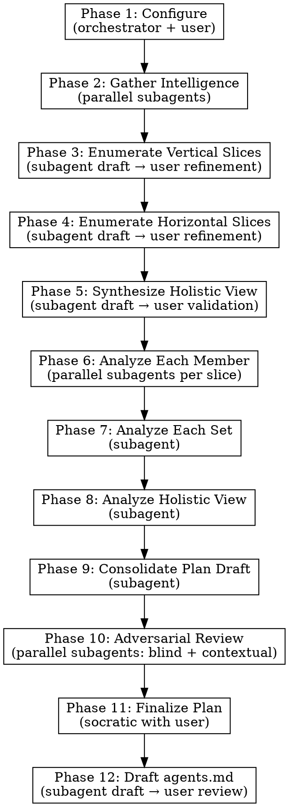

# Desloppify

## Overview

Systematic codebase audit that maps vertical slices (features end-to-end), horizontal slices (cross-cutting concerns/layers), and synthesizes a holistic view — then analyzes at every level to produce a prioritized, actionable cleanup plan.

**Core principle:** Map the terrain completely before proposing changes. The orchestrator manages flow and user interaction. Subagents do the heavy analytical work. Disk artifacts carry context between phases.

**Announce at start:** "I'm using the desloppify skill to systematically audit this codebase."

## When to Use

- Codebase has accumulated technical debt across multiple features/layers
- Architecture has drifted from its original design
- Conventions are inconsistent or undocumented
- You need a prioritized improvement plan before a major refactoring effort
- Onboarding to an unfamiliar codebase and want to understand it systematically

## When NOT to Use

- **Tiny codebases (< ~10 files)** — Just read the code and make a plan directly. 12 phases for 3 files is absurd overhead.
- **Targeted fix for a known issue** — Use systematic-debugging or just fix it.
- **Emergency hotfix** — This is a multi-hour process. Fix the fire first.
- **Single PR review** — Use requesting-code-review instead.
- **Monorepos without scoping** — Scope to one subsystem per run. For monorepos with 30+ features, the Phase 6 parallelism and Phase 9 context load become prohibitive without scoping.

## Artifact Directory

All phase outputs go to `docs/desloppify/` (or user-specified location). Each phase reads prior artifacts — subagents never re-gather what's already on disk.

## Orchestrator Flow

## Phase Execution Pattern

Each phase follows one of two patterns:

**Subagent-only** (Phases 2, 6, 7, 8, 9, 10):
1. Read phase instruction file (e.g., `./phase-2-intelligence.md`)
2. Dispatch subagent(s) with corresponding prompt template from `./prompts/`
3. Review subagent output for completeness
4. Write artifact to `docs/desloppify/`
5. Proceed to next phase

**Hybrid** (Phases 3, 4, 5, 11, 12):
1. Read phase instruction file
2. Dispatch subagent for autonomous first pass (except Phase 11 which uses Phase 9+10 outputs)
3. Present draft to user for review/refinement (socratic)
4. Iterate until user approves
5. Write final artifact to `docs/desloppify/`
6. Proceed to next phase

**Orchestrator-only** (Phase 1):
1. Read phase instruction file
2. Work directly with user
3. Write artifact to `docs/desloppify/`

## Phase Summary

| Phase | Instruction File | Prompt Template(s) | Reads | Produces |
|-------|-----------------|--------------------:|-------|----------|
| 1 | `./phase-1-configure.md` | — | Project docs | `config.md` |
| 2 | `./phase-2-intelligence.md` | `./prompts/intelligence-*.md` | `config.md` | `intelligence.md` |
| 3 | `./phase-3-vertical-slices.md` | `./prompts/enumerate-vertical-prompt.md` | `intelligence.md` | `vertical-slices.md` |
| 4 | `./phase-4-horizontal-slices.md` | `./prompts/enumerate-horizontal-prompt.md` | `intelligence.md` | `horizontal-slices.md` |
| 5 | `./phase-5-holistic-view.md` | `./prompts/holistic-view-prompt.md` | Both slices + intelligence | `holistic-view.md` |
| 6 | `./phase-6-member-analysis.md` | `./prompts/member-analysis-prompt.md` | All above | `analysis/vertical-<name>.md`, `analysis/horizontal-<name>.md` per slice |
| 7 | `./phase-7-set-analysis.md` | `./prompts/set-analysis-vertical-prompt.md`, `./prompts/set-analysis-horizontal-prompt.md` | All above + Phase 6 | `set-analysis-vertical.md`, `set-analysis-horizontal.md` |
| 8 | `./phase-8-holistic-analysis.md` | `./prompts/holistic-analysis-prompt.md` | All above | `holistic-analysis.md` |
| 9 | `./phase-9-consolidate-plan.md` | `./prompts/plan-draft-prompt.md` | All above | `desloppify-plan-draft.md` |
| 10 | `./phase-10-adversarial-review.md` | `./prompts/review-blind-prompt.md`, `./prompts/review-contextual-prompt.md` | Plan draft + codebase (blind) / All artifacts (contextual) | `review-blind.md`, `review-contextual.md` |
| 11 | `./phase-11-finalize-plan.md` | — | Plan draft + both reviews | `desloppify-plan.md` |
| 12 | `./phase-12-agents-md.md` | `./prompts/agents-md-prompt.md` | All above | `agents.md` (draft) |

## Key Principles

- **Orchestrator stays lean** — dispatches work, facilitates user interaction, never does heavy analysis itself
- **Artifacts carry context** — subagents read disk, not conversation history
- **Parallel where possible** — Phase 2 (3 parallel intelligence subagents), Phase 6 (one subagent per slice), Phase 10 (blind + contextual reviewers)
- **User validates every hybrid phase** — no phase output is final without user approval
- **Incremental execution** — the final plan produces independently-deployable improvements
- **Adversarial review before finalization** — blind and context-aware reviewers challenge the plan before the user commits
- **Sensible defaults, always overridable** — criteria and verification methods have defaults the user extends
- **Graceful degradation** — missing git history, no tests, no linter, solo developer projects all handled with explicit fallback guidance

## Resuming a Partial Run

All phase outputs are written to `docs/desloppify/` as they complete. If a session ends mid-pipeline:

1. Start a new session and invoke desloppify
2. Point to the existing `docs/desloppify/` directory
3. The orchestrator checks which artifacts exist and resumes from the next incomplete phase
4. User-validated artifacts (from hybrid phases) don't need re-validation unless the user requests it

## Integration

**Works well with:**
- **superpowers:writing-plans** — Desloppify plan can feed into writing-plans for detailed implementation
- **superpowers:executing-plans** — Execute the desloppify plan task-by-task
- **superpowers:dispatching-parallel-agents** — Phase 2 and 6 use parallel dispatch pattern
- **superpowers:subagent-driven-development** — Execute improvements with review gates

**After desloppify completes**, offer the user:
1. Feed the plan into writing-plans for detailed implementation planning
2. Save artifacts and revisit later
3. Execute specific high-priority items immediately
